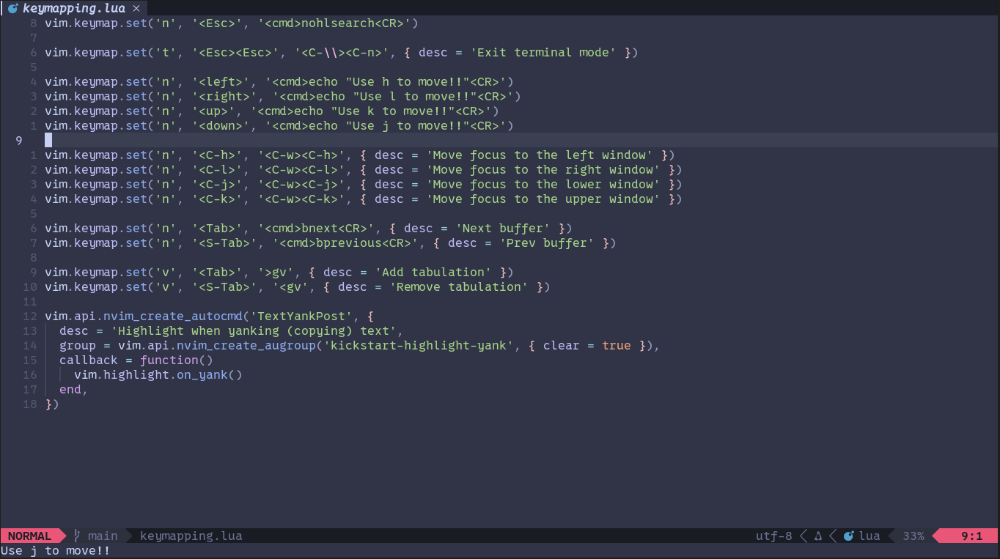

# NvCofefy
NvCofefy is a complete neovim setup with ton of useful feachures.

## Plugins
- [lazy.nvim](https://github.com/folke/lazy.nvim.git)
- [telescope.nvim](https://github.com/nvim-telescope/telescope.nvim)
- [whitch-key.nvim](https://github.com/folke/which-key.nvim)
- [autopairs](https://github.com/windwp/nvim-autopairs)
- [bufferline.nvim](https://github.com/akinsho/bufferline.nvim)
- [lualine.nvim](https://github.com/nvim-lualine/lualine.nvim)
- [gitsigns.nvim](https://github.com/lewis6991/gitsigns.nvim)
- [vim-illuminate](https://github.com/RRethy/vim-illuminate)
- [indent-blankline.nvim](https://github.com/lukas-reineke/indent-blankline.nvim)
- [catppuccin/nvim](https://github.com/catppuccin/nvim)
- [nvim-web-devicons](https://github.com/nvim-tree/nvim-web-devicons)
- [lazydev.nvim](https://github.com/folke/lazydev.nvim)
- [luvit-meta](https://github.com/Bilal2453/luvit-meta)
- [nvim-cmp](https://github.com/hrsh7th/nvim-cmp)
- [plenary.nvim](https://github.com/nvim-lua/plenary.nvim)
- [ripgrep](https://github.com/BurntSushi/ripgrep)
- [vim-sleuth](https://github.com/tpope/vim-sleuth)
- [nvim-treesitter](https://github.com/nvim-treesitter/nvim-treesitter)
- [conform.nvim](https://github.com/stevearc/conform.nvim)
- [nvim-lspconfig](https://github.com/neovim/nvim-lspconfig)
    - [mason.nvim](https://github.com/williamboman/mason.nvim)
    - [mason-lspconfig.nvim](https://github.com/williamboman/mason-lspconfig.nvim)
    - [mason-tool-installer.nvim](https://github.com/WhoIsSethDaniel/mason-tool-installer.nvim)
    - [fidget.nvim](https://github.com/j-hui/fidget.nvim)
    - [cmp-nvim-lsp](https://github.com/hrsh7th/cmp-nvim-lsp)

## Requirements
- neovim
- git 
- unzip
- wget
- curl
- gzip
- tar
- python
- lua
- npm
- java
- ripgrep
- node
- build-essential

## Installation
If you already have vnim config then run "mv ~/.config/nvim ~/.config/nvim_backup" or back it up in some other way.

1) Enter .config folder "cd ~/.config"
2) Create nvim config folder "mkdir nvim"
3) Fork NvCofefy repo to your page and clone it into nvim folder "git clone "https://github.com/<YourUsername>/NvCofefy"" or just use original repo "git clone "https://github.com/UAPROGRAMER/NvCofefy""
4) Make sure all requirements were satisfied and run nvim
5) Run :checkhealth and you can goon from here 

## Contributing
Create fork of this repo, make some changes and create pull request on main repo.
